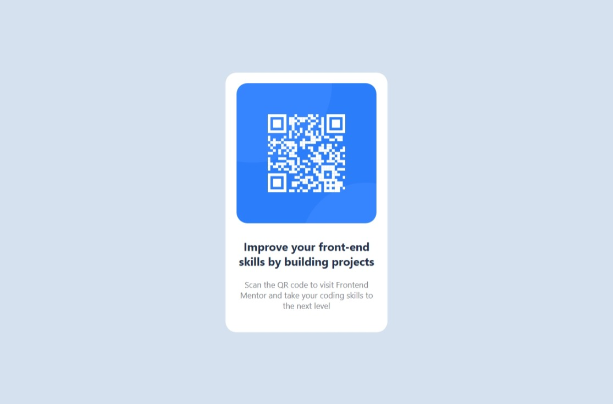

# Frontend Mentor - QR code component solution

This is a solution to the [QR code component challenge on Frontend Mentor](https://www.frontendmentor.io/challenges/qr-code-component-iux_sIO_H).
## Table of contents

- [Frontend Mentor - QR code component solution](#frontend-mentor---qr-code-component-solution)
  - [Table of contents](#table-of-contents)
  - [Overview](#overview)
    - [Screenshots](#screenshots)
      - [Desktop version](#desktop-version)
      - [mobile version](#mobile-version)
    - [Links](#links)
  - [My process](#my-process)
    - [Built with](#built-with)
    - [What I learned](#what-i-learned)
      - [How to center the content](#how-to-center-the-content)
  - [Author](#author)


## Overview

### Screenshots

#### Desktop version


#### mobile version


### Links
- Solution URL: [Git Repo](https://github.com/MrMohammedMath/QR-code-component.git)
- Live Site URL: [qr-code-component-mh.netlify.app](https://qr-code-component-mh.netlify.app)

## My process

### Built with

- Flexbox
- Mobile-first workflow
- [SCSS](https://sass-lang.com/s)
- [BEM](https://en.bem.info/)
- [React](https://reactjs.org/) - JS library

### What I learned

#### How to center the content

```scss
#root{
    display: flex;
    justify-content: center;
    align-items: center;

    position: fixed;
    top: 0;
    right: 0;
    bottom: 0;
    left: 0;
}
```

## Author

- Frontend Mentor - [@Mohammed Hassan](https://www.frontendmentor.io/profile/MrMohammedMath)